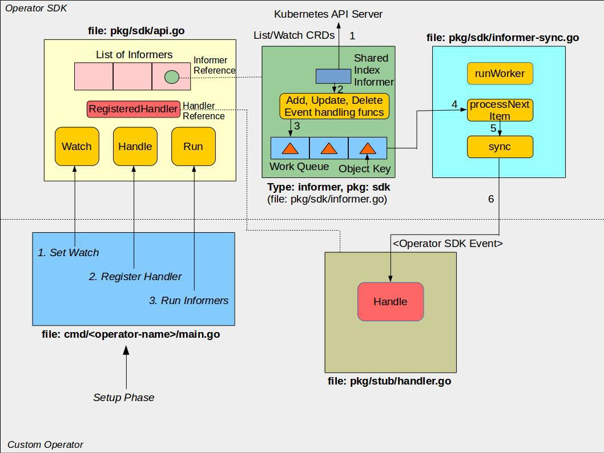

# Kubernetes Operators

## Kubernetes Custom Resource Definition

- **A Resource** - is an endpoint that stores a collection of API objects of a
certain kind For example, the built-in pods resource contains a collection of Pod objects.

- **A Custom Resource** - is an object that extends the Kubernetes API.
It allows you to introduce your own API into a project or a cluster.

- **A Custom Resource Definitions (CRD)** - is a file that describes your own object
kinds and lets the Kubernetes API server handle the entire lifecycle. Deploying
a CRD into the cluster causes the Kubernetes API server to begin serving the specified custom resource.

Example:
```yaml
apiVersion: apiextensions.k8s.io/v1beta1
kind: CustomResourceDefinition
metadata:
  # name must match the spec fields below, and be in the form: <plural>.<group>
  name: crontabs.stable.example.com
spec:
  # group name to use for REST API: /apis/<group>/<version>
  group: stable.example.com
  # list of versions supported by this CustomResourceDefinition
  versions:
    - name: v1
      # Each version can be enabled/disabled by Served flag.
      served: true
      # One and only one version must be marked as the storage version.
      storage: true
  # either Namespaced or Cluster
  scope: Namespaced
  names:
    # plural name to be used in the URL: /apis/<group>/<version>/<plural>
    plural: crontabs
    # singular name to be used as an alias on the CLI and for display
    singular: crontab
    # kind is normally the CamelCased singular type. Your resource manifests use this.
    kind: CronTab
    # shortNames allow shorter string to match your resource on the CLI
    shortNames:
    - ct
```

## Exercise 1 - Prepare minikube environment

## Exercise 2 - Deploy ETCD cluster using ETCD-Operator

### Setup ETCD Operator 

Install RBAC rules (cluster Roles and RoleBindings):
```bash 
# Create ClusterRole object
echo | kubectl create -f - <<EOF
apiVersion: rbac.authorization.k8s.io/v1beta1
kind: ClusterRole
metadata:
  name: etcd-operator
rules:
- apiGroups:
  - etcd.database.coreos.com
  resources:
  - etcdclusters
  - etcdbackups
  - etcdrestores
  verbs:
  - "*"
- apiGroups:
  - apiextensions.k8s.io
  resources:
  - customresourcedefinitions
  verbs:
  - "*"
- apiGroups:
  - ""
  resources:
  - pods
  - services
  - endpoints
  - persistentvolumeclaims
  - events
  verbs:
  - "*"
- apiGroups:
  - apps
  resources:
  - deployments
  verbs:
  - "*"
# The following permissions can be removed if not using S3 backup and TLS
- apiGroups:
  - ""
  resources:
  - secrets
  verbs:
  - get
EOF

# Create ClusterRoleBinding object
echo | kubectl create -f - <<EOF
apiVersion: rbac.authorization.k8s.io/v1beta1
kind: ClusterRoleBinding
metadata:
  name: etcd-operator
roleRef:
  apiGroup: rbac.authorization.k8s.io
  kind: ClusterRole
  name: etcd-operator
subjects:
- kind: ServiceAccount
  name: default
  namespace: default
EOF
```

Verify that RBAC objects are created
```bash
# Verify that RBAC objects are present:
kubectl get clusterrole etcd-operator

kubectl get clusterrolebinding etcd-operator
```

Install ETCD Operator itself:
```bash
echo | kubectl create -f - <<EOF
apiVersion: extensions/v1beta1
kind: Deployment
metadata:
  name: etcd-operator
spec:
  replicas: 1
  template:
    metadata:
      labels:
        name: etcd-operator
    spec:
      containers:
      - name: etcd-operator
        image: docker.io/prgcont/etcd-operator:v0.9.2
        command:
        - etcd-operator
        # Uncomment to act for resources in all namespaces. More information in doc/clusterwide.md
        #- -cluster-wide
        env:
        - name: MY_POD_NAMESPACE
          valueFrom:
            fieldRef:
              fieldPath: metadata.namespace
        - name: MY_POD_NAME
          valueFrom:
            fieldRef:
              fieldPath: metadata.name
EOF

# Verify that etcd-operator deployment is running
kubectl get deployment etcd-operator

# Verify that etcd-operator created CRD 
kubectl get crd
```

### Install ETCD Cluster using ETCD Operator

```bash
echo | kubectl create -f - <<EOF
apiVersion: "etcd.database.coreos.com/v1beta2"
kind: "EtcdCluster"
metadata:
  name: "example-etcd-cluster"
spec:
  size: 3
  version: "3.2.13"
  repository: "docker.io/prgcont/etcd"
EOF
```

Verify the state of deployed ETCD cluster
```bash
kubectl describe etcdcluster example-etcd-cluster
```

#### Check the health of ETCD Cluster ####

Exec into one ETCD pod
```bash
# Get arbitrary pod name using 
kubectl get po -l etcd_cluster=example-etcd-cluster

# Exec into etcd pod
kubectl exec -it <POD_NAME> -- sh

# In container:
# Update env variable
export ETCDCTL_API=3

# List ETCD members 
etcdctl member list

# Write and read record
etcdctl put /here test
etcdctl get /here
```

#### Optional exercises ####

- Scale Currently deployed ETCD cluster and verify that record you made into the DB still exists,
- deploy ETCD cluster in other namespaces (see the *Note on Cluster wide operators*)

#### Note on Cluster wide operators ####

The above example created `etcd-operator` in `default` namespace and ETCD Cluster in same namespace. 
By default ETCD Operator reacts only on `etcdcluster` objects that are in same namespace. This behavior can be changed by passing arg `-cluster-wide` to `etcd-operator` and creating `etcdcluster` object with annotation: `etcd.database.coreos.com/scope: clusterwide`. From our example: 

```yaml
apiVersion: "etcd.database.coreos.com/v1beta2"
kind: "EtcdCluster"
metadata:
  name: "example-etcd-cluster"
  annotations:
    etcd.database.coreos.com/scope: clusterwide
spec:
  size: 3
  version: "3.2.13"
  repository: "docker.io/prgcont/etcd"
```

Note: You need to update RBAC rules if you want ETCD Operator to manage resources across all kubernetes cluster. 

### Cleanup ETCD Operator from k8s cluster

```bash
kubectl delete etcdcluster example-etcd-cluster
kubectl delete -f example/deployment.yaml
kubectl delete endpoints etcd-operator
kubectl delete crd etcdclusters.etcd.database.coreos.com
kubectl delete clusterrole etcd-operator
kubectl delete clusterrolebinding etcd-operator
```

## Operator Framework

[Operator Framework](https://coreos.com/operators/) is set of tools that simplifies creation and lifecycle management of k8s operators.

The operators created by Operator Framework are using same primitives like k8s controller which can be found in this diagram:



### Operator SDK ###

 

### Operator Lifecycle Manager ###


- Introduce/describe
- Walk through components
  - Lifecycle manager
  - Operator-SDK

## Exercise 3 - Write simple Operator in Python
