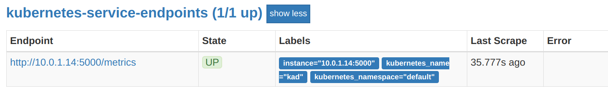
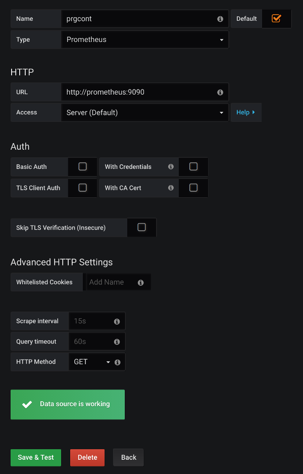
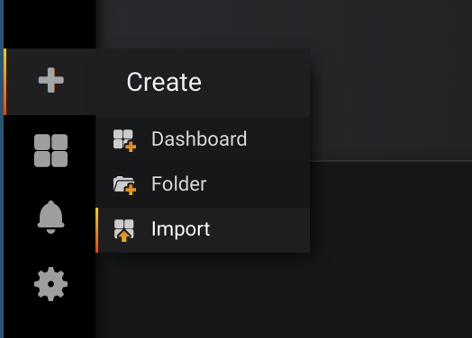
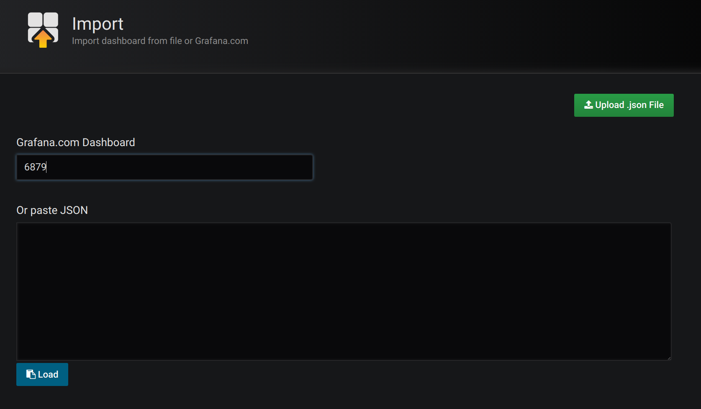

# Prometheus - Kubernetes monitored

## Table of Contents
- [Prerequisites](#Prerequisites)
- [Run Prometheus in Kubernetes](#run-prometheus-in-kubernetes)
  - [Prepare the Namespace](#prepare-the-namespace)
  - [Deploying Prometheus](deploying-prometheus)
    - [ConfigMap](#configmap)
    - [Prometheus](#prometheus)
    - [Prometheus Service](#prometheus-service)
- [Monitor your application](#monitor-your-application)
- [Visualize metrics](#visualize-metrics)
- [Prometheus Node Exporter](#prometheus-node-exporter)

## Prerequisites
- `git clone https://github.com/prgcont/workshop-k8s && cd workshop-k8s/src/prometheus`
- [Install Hypervisor](https://github.com/prgcont/workshop-k8s/tree/master/lesson-1#install-hypervisor)
- [Install Minikube](https://github.com/prgcont/workshop-k8s/tree/master/lesson-1#install-minikube)
- [Install Kubeectl](https://github.com/prgcont/workshop-k8s/tree/master/lesson-1#install-minikube)
- [Test Your Setup](https://github.com/prgcont/workshop-k8s/tree/master/lesson-1#run-minikube)

## Run Prometheus in Kubernetes

### Prepare the Namespace
We're going to follow the best practices and run everything monitoring-related in a special namespaces, the namespaces will be named `monitoring`. To create the new namespace in Kubernetes run:

```bash
kubectl create namespace monitoring
```

Now list all the namespaces via:
```
kubectl get namespaces
NAME          STATUS    AGE
default       Active    4m
kube-public   Active    4m
kube-system   Active    4m
monitoring    Active    5s
```
As you can see, `monitoring` namespace was created successfully.

### Deploying Prometheus

NOTE: All `kubectl apply` commands should be run from the cloned workshop-k8s
repository (see [Prerequisites]([Prerequisites](#Prerequisites)).

#### ConfigMap
Prometheus will get its configuration from a [Kubernetes ConfigMap](https://kubernetes.io/docs/tasks/configure-pod-container/configure-pod-configmap/).
This allows us to update the configuration separate from the image.
This is just a [Prometheus configuration](https://github.com/prometheus/prometheus/blob/master/documentation/examples/prometheus-kubernetes.yml)
transformed to the Kubernetes manifest.

To deploy this to Kubernetes run
```bash
kubectl apply -f prometheus-config.yaml
```

Make sure that the ConfigMap was created successfully:
```bash
kubectl get configmap prometheus-config -n monitoring
NAME                DATA      AGE
prometheus-config   1         25s
```

#### Prometheus

[Here](https://github.com/prgcont/workshop-k8s/blob/master/src/prometheus/prometheus-deployment.yaml)
is the Prometheus deployment that we're going to use during our workshop

In the *metadata section*, we give the pod a label with a key of name and a value of Prometheus.
This will come in handy later.

In *annotations*, we set a couple of key/value pairs that will actually allow Prometheus
to autodiscover and scrape itself.

We are using an [*emptyDir*](https://kubernetes.io/docs/concepts/storage/volumes/#emptydir)
volume for the Prometheus data. It exists as long as Prometheus Pod is running on that node.
As the name says, it is initially empty.
Containers in the Prometheus Pod can all read and write the same files in the emptyDir volume,
though that volume can be mounted at the same or different paths in each Container.
When a Pod is removed from a node for any reason, the data in the *emptyDir* is deleted forever.

To install Prometheus run the following command:

```bash
kubectl apply -f prometheus-deployment.yaml
```

Make sure that prometheus is up and running:
```bash
kubectl get deployments -n monitoring
NAME         DESIRED   CURRENT   UP-TO-DATE   AVAILABLE   AGE
prometheus   1         1         1            1           52s
```

#### Prometheus Service
In order to get to the UI of Prometheus we have to expose it via [Kubernetes Services](https://kubernetes.io/docs/concepts/services-networking/service/). In our
workshop we will use [NodePort](https://kubernetes.io/docs/concepts/services-networking/service/#nodeport)

To add NodePort service to your kubernetes cluster run
```bash
kubectl apply -f prometheus-service.yaml
```
List all your services in `monitoring` namespace:
```bash
kubectl get svc -n monitoring
NAME         TYPE       CLUSTER-IP      EXTERNAL-IP   PORT(S)          AGE
prometheus   NodePort   10.102.142.14   <none>        9090:30090/TCP   9s
```

Now you can open Prometheus UI via:
```bash
minikube service prometheus -n monitoring
```

or find name of Prometheus pod (`kubectl -n monitoring get po`) and connect to pod directly
```bash
kubect -n monitoring port-forward paste_prometheus_pod_name 9090
```

Click `Status -> Targets`and you should see the Kubernetes cluster and nodes. You should also see that Prometheus discovered itself under kubernetes-pods.

## Monitor your application

We will run sample application in our cluster and add this application to Prometheus monitoring. We will be using Prometheus service discovery which means that Prometheus will automatically discover our application and will start scraping it. The application is exporting metrics on `/metrics` endpoint.

First step is to deploy the application:
```bash
kubectl apply -f kad.yaml
```

It will start one pod and create service targeting this pod. The most important part of service definition are the annotations. These annotations are processes by prometheus and service with these annotation is scraped.

```yaml
apiVersion: v1
kind: Service
metadata:
  name: kad
  annotations:
    prometheus.io/scrape: "true"
```

Next step is to verify Prometheus is scraping our application. There are several ways to verify it:
* In Prometheus UI: Status -> Targets contains target with label `kubernetes_name="kad"`
  
* In Prometheus UI: Status -> Service discovery -> kubernetes-services endpoints discovered kad service
* Run query in Prometheus UI: [`up{kubernetes_name="kad"}`](http://localhost:9090/graph?g0.range_input=1h&g0.expr=up%7Bkubernetes_name%3D%22kad%22%7D&g0.tab=1)

There is an alert prepared for monitoring kad application so you can take a look at `Alerts` tab.

## Tips

* Reload prometheus configuration: `kill -HUP 1` in container


## Visualize metrics

Previous parts helped us to start Prometheus in Kubernetes and it's time to take a look at the metrics now. There are many ways to display the metrics and we will try two most used ones.

### Prometheus UI graph

Prometheus UI is bundled in Prometheus daemon and it can be used for basic visualization. It's sufficient for preparing queries but Grafana is better for serious work.

Find name of Prometheus pod
```bash
kubectl -n monitoring get po
NAME                         READY     STATUS    RESTARTS   AGE
prometheus-647f4b785-lcdzc   1/1       Running   0          1d
```

Open port-forwaring to Prometheus pod, port 9090
```bash
kubectl -n monitoring port-forward prometheus-647f4b785-lcdzc 9090
```

Open [127.0.0.1:9090/graph](http://127.0.0.1:9090/graph) in web browser

Let's show graph for container memory usage:

1. Click on Graph
1. Write expression: container_memory_usage_bytes
1. Press execute - it can take some time if you have many containers running in a cluster

However, query language is much more powerful. Try these expressions:
* [`container_memory_usage_bytes{namespace="monitoring"}`](http://localhost:9090/graph?g0.range_input=1h&g0.expr=container_memory_usage_bytes%7Bnamespace%3D%22monitoring%22%7D&g0.tab=0)
* [`kubernetes_build_info`](http://localhost:9090/graph?g0.range_input=1h&g0.expr=kubernetes_build_info&g0.tab=0)
* [`go_goroutines{kubernetes_namespace="monitoring"}`](http://localhost:9090/graph?g0.range_input=1h&g0.expr=go_goroutines%7Bkubernetes_namespace%3D%22monitoring%22%7D&g0.tab=0)
* [`predict_linear(node_filesystem_free_bytes[10m], 30*24*3600)`](http://localhost:9090/graph?g0.range_input=1h&g0.expr=predict_linear(node_filesystem_free_bytes%5B10m%5D%2C%2030*24*3600)&g0.tab=0)

### Grafana

Grafana is a tool for visualization and it can load data from many different backends, including Prometheus. Grafana dashboards can be created manually, auto-generated or imported from [Grafana.com Dashboards](https://grafana.com/dashboards). The goal of this part is to configure Prometheus datasource in grafana and explore some dashboard.

First we need to start Grafana pod in monitoring namespace.
```bash
kubectl apply -f grafana-deployment.yaml
```

and check that grafana container is running:
```bash
kubectl -n monitoring get po
NAME                         READY     STATUS    RESTARTS   AGE
grafana-646f55c587-xlp2n     1/1       Running   0          4m
```

Open connection to grafana and don't forget to replace `grafana-646f55c587-xlp2n` with name of your grafana pod.
```bash
kubectl -n monitoring port-forward grafana-646f55c587-xlp2n 3000
```

Open [127.0.0.1:3000/](http://127.0.0.1:3000) in web browser


We need to first configure data source which will enable grafana to read metrics from Prometheus:

1. Login with username `admin` and password `admin`
1. You will be asked to change password but it can be skipped
1. Click `Add data source` and configure datasource according to screenshot below

  
1. Click "Save & Test", You should see "Datasource is working"


Next step is to add some dashboards which can be created manually but we will just import predefined dashboard:

1. Move mouse over plus sign on top left side of page

  

1. Click Import
1. Write `6879` to field with title "Grafana.com Dashboard". This import feature can be used to import dashboard from JSON which is convenient way to export/load your dashboards.

  

1. Click Load
1. Select Prometheus datasource prgcont as depicted in screenshot

  

1. Click import
1. Discover provided graphs

You can try to import [3662](https://grafana.com/dashboards/3662) and check Prometheus daemon usage.

## Prometheus Node Exporter
We can also use Prometheus to collect metrics of the nodes themselves.
We use the **node exporter** for this. We can also use Kubernetes to deploy this
to every node. We will use a [Kubernetes DaemonSet](https://kubernetes.io/docs/concepts/workloads/controllers/daemonset/) to do so.

In `node-exporter-daemonset.yaml` you will see that it looks similar to the
deployment we did earlier. Notice that we run this in privileged mode `privileged: true`
as it needs access to various information about the node to perform monitoring.
The `privileged: true` mode is simplification for the demo purpose, you should not
use it in production.
Also notice that we are mounting in a few node directories to monitor various things.

To create the DaemonSet run
```bash
kubectl apply -f node-exporter-daemonset.yaml
```
This will run an instance of this on every node. In minikube, there is only one
node, but you can run the same thing on your own kubernetes cluster and scale to
thousand nodes.

After a minute or so, Prometheus will discover the node itself and begin
collecting metrics from it.

**Tasks:**
- Try to create a dashboard in Grafana using node metrics (use `node_load1` as the metric query)  
